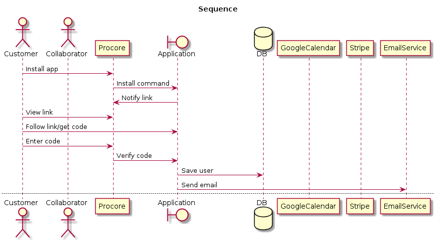
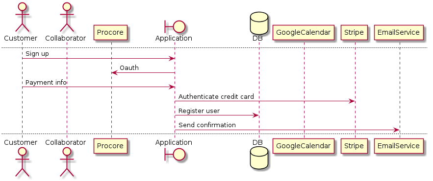
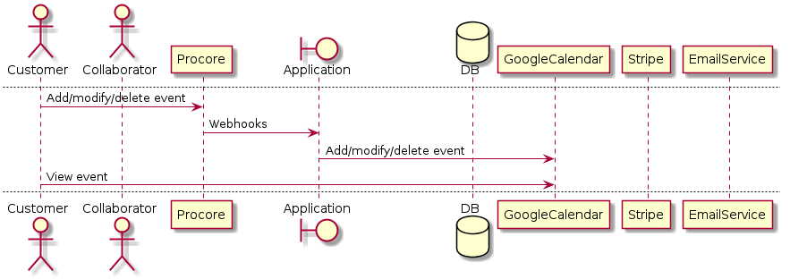
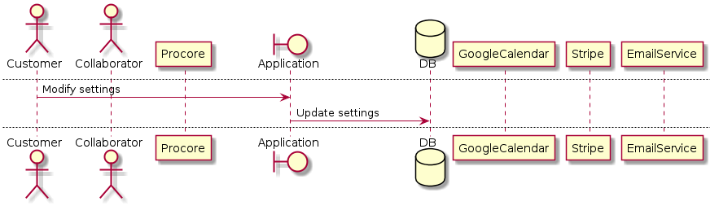
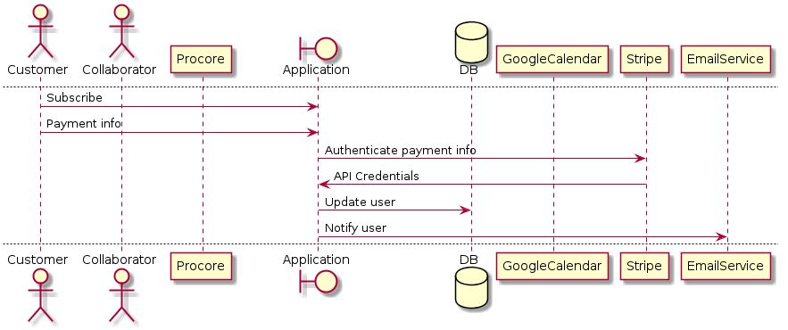
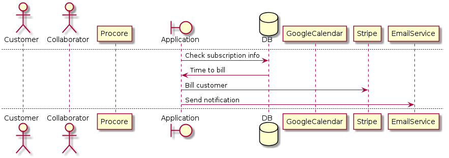
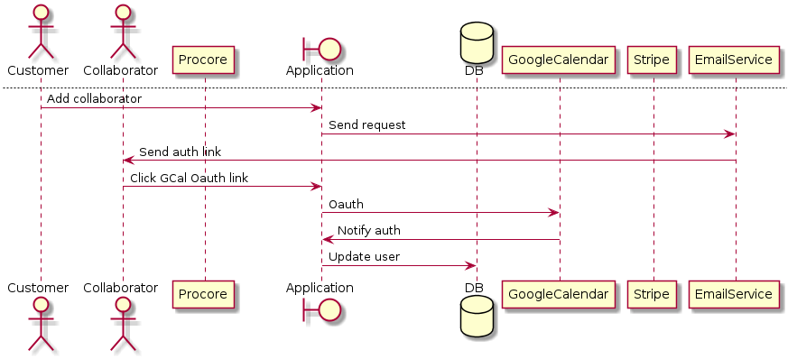
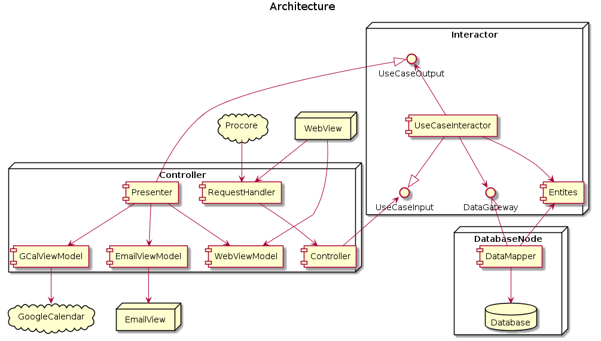

# Procore Google Calendar Integrator

## Summary

This is an application for syncing events on Procore (RFI's, calendar events, etc.) to a user(s) Google Calendar(s). This is a data connection application to be available on the Procore app store. It will feature an API interface with Procore, Google Calendar, some email service, some payments service (Stripe or some other) and a web front end interface.

## Use Cases

### Installation from Procore

### Sign up from web interface

### Manage events on Procore

### Modify user settings

### Subscribe after free trial

### Bill customer

### Add collaborator

## Architecure

